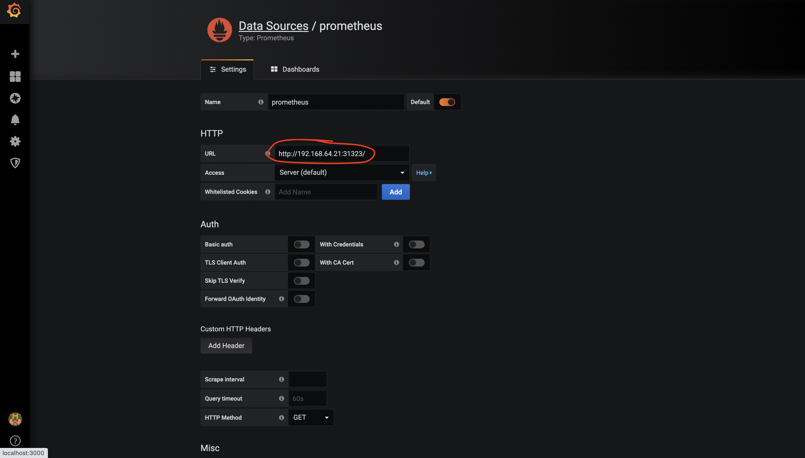
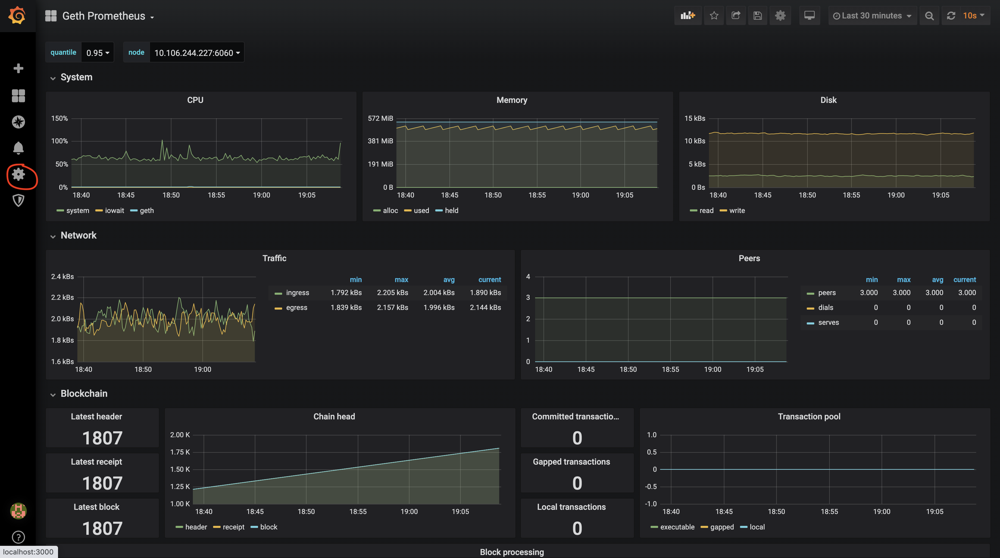
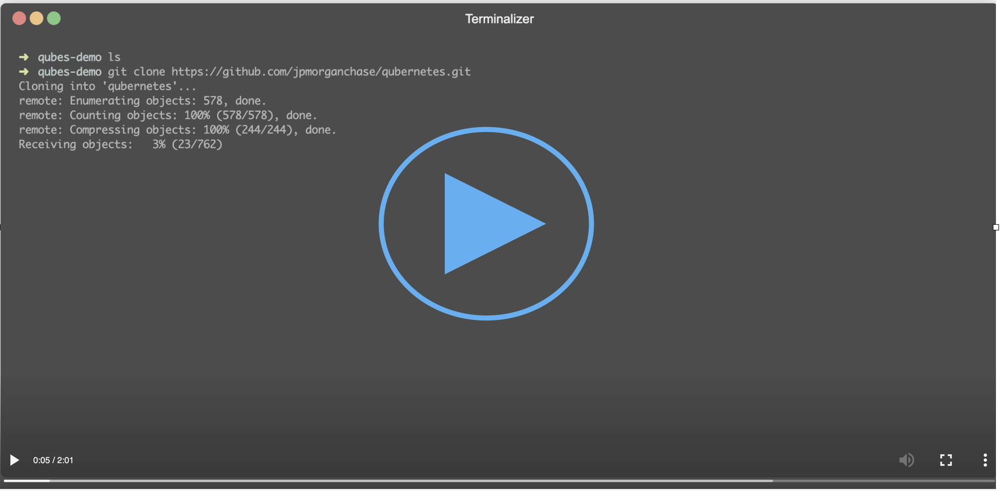

## Running Grafana with Prometheus

## Create Your K8s Cluster With Prometheus Enabled

**note** - because K8s kind does not work with NodePort. Please use minikube or a managed K8s env.

Example qubernetes.yaml config:

```yaml
nodes:
  number: 4
quorum:
  quorum:
    # supported: (raft | istanbul)
    consensus: istanbul
    Quorum_Version: 2.6.0
  tm:
    # (tessera|constellation)
    Name: tessera
    Tm_Version: 0.10.4
prometheus:
  # override the default monitor startup params --metrics --metrics.expensive --pprof --pprofaddr=0.0.0.0.
  #monitor_params_geth: --metrics --metrics.expensive --pprof --pprofaddr=0.0.0.0
  nodePort_prom: 31323
```

## From Inside This Directory (qubernetes/monitor/grafana)
```bash
> docker-compose up -d
```

You should now be able to access the Grafana dashboard from [localhost:3000](http://localhost:3000) (admin:admin).

## Update The Datasource
You will need to update the datasource for Prometheus from inside grafana so that the IP points to your K8s node IP, e.g. 
if running minikube run `minikube ip` to obtain the node ip.






## Stopping Grafana
```bash
> docker-compose down
```

## Demo
[](https://jpmorganchase.github.io/qubernetes/resources/grafana-demo.webm)

## Shoutout to chapsuk and karalabe for the sweet grafana databases. 
* https://github.com/chapsuk/geth-prometheus
* https://github.com/karalabe/geth-prometheus
