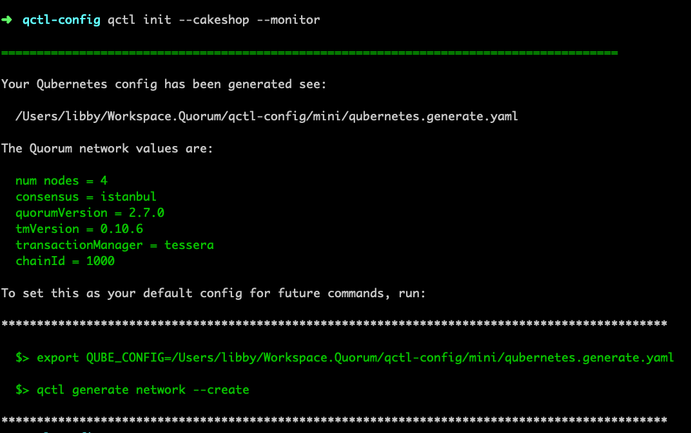

## Qubernetes Command Line Tool: qctl 

A command line tool for creating, running and interacting with a K8s Quorum network. 
 
The commands intentionally try to do only one thing (Unix philosophy). They can be added to scripts to automate complete 
network creation / deletion, etc. 

### Install

Requires golang version >  1.13
```
> GO111MODULE=on go get github.com/ConsenSys/qubernetes/qctl 
```

```
> qctl --help

NAME:
   qctl - command line tool for managing qubernetes network. Yay!

USAGE:
   qctl [global options] command [command options] [arguments...]

COMMANDS:
   log, logs        Show logs for [quorum, tessera, constellation], running on a specific pod
   init             creates a base qubernetes.yaml file which can be used to create a Quorum network.
   test             run tests against the running network
   generate         options for generating base config / resources
   delete, destroy  options for deleting networks / resources
   stop             options for stopping nodes.
   update           options for updating nodes / resources
   deploy           options for deploying networks / resources to K8s
   geth             options for interacting with geth
   list, ls, get    options for listing resources
   add              options for adding resources
   connect, c       connect to nodes / pods
   help, h          Shows a list of commands or help for one command

GLOBAL OPTIONS:
   --namespace value, -n value, --ns value  The k8s namespace for the quorum network (default: "default") [$QUORUM_NAMESPACE]
   --help, -h                               show help (default: false)
``` 
Config and network variables, can be set in environment variables or passed in via commnand line flags.  

### Initialize A Quorum Network / Config 
```
$> qctl init --cakeshop --monitor 
```


copy the `export` command output at the end of running the `init` command  
```
$> export QUBE_CONFIG="YOUR/PATH/qubernetes.generate.yaml"
```
and run the `generate` command.
```
$> qctl generate network --create
```


Copy the `export` command output at the end of running the `generate` command. 
```
$> export QUBE_K8S_DIR=/YOUR/PATH/out
```

### Deploying The Qubernetes K8s Network
**This requires a running K8s network**, either local (kind, [minikube](../docs/minikube-docs.md), docker on desktop) or cloud provider (GKE, EKS, Azure),
or other managed K8s runtime.

Start up your K8s environment, e.g. `minikube start --memory 6144`

```
$> qctl deploy network --wait
```

### Interacting With The Network

the `test` command can both private and public contract deployment.  
`qctl test --help`
```
> qctl test contract quorum-node1
> qctl test contract quorum-node1 --private
> qctl test contract quorum-node1 --public
```

display the current config that is being used to generate the network
```
$> qctl ls config
$> qctl ls config --long
```
list node information
```
$> qctl ls nodes 
$> qctl ls nodes --all
$> qctl ls nodes --bare --enode
$> qctl ls nodes --bare --enode quorum-node1
"enode://3a1912d30257c99d10f3795bff6731493f7985dfaf188f85f46ff8c8074d98a456eab1a850a6f57cdc3f28611cbfb10da001e7a3f10a73baaf095866b7f1acb1@quorum-node1:30303?discport=0&raftport=50401"
```

execute a geth command on a specific node
```
> qctl geth exec quorum-node1 'eth.blockNumber'
```

attach to geth on a specific node
```
> qctl geth attach quorum-node1

connecting to geth /etc/quorum/qdata
Welcome to the Geth JavaScript console!

instance: Geth/v1.9.7-stable-6005360c(quorum-v2.7.0)/linux-amd64/go1.13.13
coinbase: 0x5dc833a384369714e05d1311e40a8b244be772af
at block: 19 (Tue, 06 Oct 2020 00:24:05 UTC)
 datadir: /etc/quorum/qdata/dd
 modules: admin:1.0 debug:1.0 eth:1.0 istanbul:1.0 miner:1.0 net:1.0 personal:1.0 quorumExtension:1.0 rpc:1.0 txpool:1.0 web3:1.0

>
```

## Adding Node Resources

To add a new node to the network run: add, generate, deploy.  
`add` adds the node to the qubernetes config
```
$> qctl add node quorum-node5
$> qctl ls nodes 
```
cakeshop and monitoring can also be added the same way
```
$> qctl add cakeshop
$> qctl add --help
```

generate the additional config / keys / resources
```
$> qctl generate network --update
```

deploy the new node(s) to K8s
```
$> qctl deploy network --wait
```

### Follow Quorum Logs
```
> qctl logs -f quorum-node1 quorum
```

### Follow Tessera Logs
```
> qctl logs -f quorum-node1 tessera 
```

### Destroy / Delete The Network
```
$> qctl destroy network
``` 

### (for developers) Run the acceptance test
example running with minikube
```
> qctl test accepttest --node-ip=$(minikube ip)
``` 